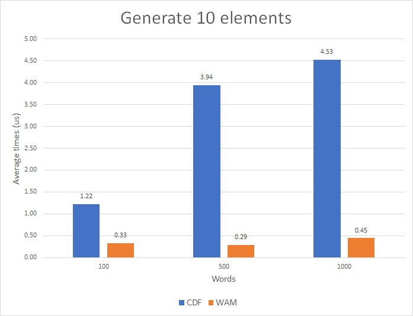

# markov_rs

[](https://github.com/ichi-h/markov_rs/actions/workflows/markov_rs.yml)
[](https://crates.io/crates/markov_rs)
[](https://docs.rs/markov_rs)
[](LICENSE-APACHE)

A simple and fast Markov Chain generator in Rust.

By using the Walker's Alias Method (WAM), a weighted random sampling algorithm, the model can generate elements very quickly. For details about the WAM, see [ichi-h / weighted_rand](https://github.com/ichi-h/weighted_rand).

## Benchmark

The benchmark for this crate and the Markov Chain using the Cumulative Distribution Function (CDF) is as follows.

### Environment

- OS: Windows 11 Home Insider Preview
- CPU: Intel(R) Core(TM) i7-6700HQ CPU @ 2.60GHz
- RAM: 16.0 GB
- Rust version: rustc 1.56.1
- Source code: [benchmark.rs](benches/benchmark.rs)

### Create Markov Chain model

The time to create a Markov Chain model from each of the dummy texts of 100, 500, and 1000 words.


For both models, the generation time increases as the number of words in the text increases, but the slope of the time is larger for the WAM.

### Generate elements

The time to generate 10 elements from the above models.



The CDF is slower to generate elements as the number of words in the text increases, but the WAM remains fast regardless.

## Usage

Add this to your Cargo.toml:

```toml
[dependencies]
markov_rs = "0.1"
```

## Example

```rust
use markov_rs::MarkovChain;

fn main() {
    let text = [
        "I", "think", "that", "that", "that", "that", "that", "boy", "wrote", "is", "wrong",
    ];
    let mut model = MarkovChain::from(&text);
    for _ in 0..20 {
        print!("{} ", model.next());
    }
}
```

## Planned

- Improve performance of model building.
- Support for Nth-order Markov Chain.

## License

Licensed under either of

- Apache License, Version 2.0
  ([LICENSE-APACHE](LICENSE-APACHE) or http://www.apache.org/licenses/LICENSE-2.0)
- MIT license
  ([LICENSE-MIT](LICENSE-MIT) or http://opensource.org/licenses/MIT)

at your option.

## Contribution

Unless you explicitly state otherwise, any contribution intentionally submitted
for inclusion in the work by you, as defined in the Apache-2.0 license, shall be
dual licensed as above, without any additional terms or conditions.
